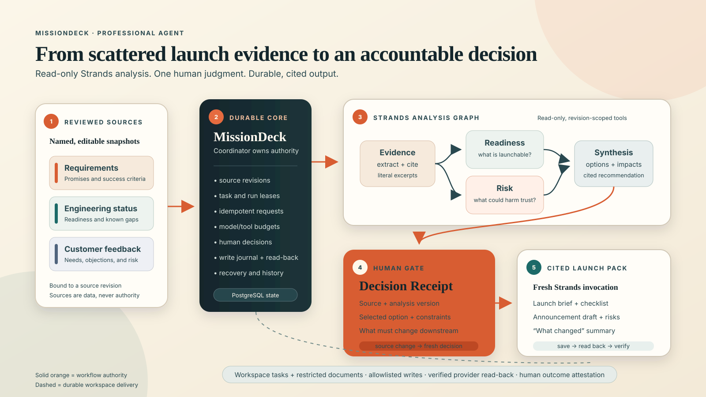

# MissionDeck

**A release-readiness agent for small product teams.**

MissionDeck reconciles product requirements, engineering status, and customer feedback; asks a person only for the launch tradeoff that needs human judgment; then produces a cited launch pack that honors that decision.

Built with the [Strands Agents SDK](https://strandsagents.com/) for the **Professional Agents** track of the [Agents for Humans Hackathon](https://agentsforhumans.devpost.com/).



## The problem

A launch decision rarely lives in one document. Product copy may promise a feature that engineering has not cleared. Customer feedback may reveal a rollout risk that the checklist missed. Small teams spend hours manually reconciling those sources, and a generic summary still leaves the person responsible for deciding what to do.

MissionDeck turns that scattered, judgment-heavy work into one bounded flow:

1. Review three named source snapshots: requirements, engineering status, and customer feedback.
2. Let a Strands graph extract cited evidence, run readiness and risk analysis in parallel, and synthesize a decision brief.
3. Make the one consequential choice. MissionDeck records the selected option and any constraints as a **Decision Receipt** tied to the exact source revision.
4. Generate a fresh launch pack: launch brief, readiness checklist, announcement draft, unresolved risks, and a summary of what changed because of the decision.
5. Save and read back the resulting documents, then require a person to verify the outcome.

The included **Harbor launch review** is a fictional, editable scenario. It deliberately contains a conflict between a calendar-integration promise and engineering readiness so the decision flow is visible without using private company data.

## Why the Decision Receipt matters

Most AI workflows end with an answer. MissionDeck keeps the chain of responsibility.

Each Decision Receipt records:

- the source revision and analysis version the recommendation was based on;
- the option chosen by the human reviewer;
- constraints the launch pack must honor; and
- the human judgment that gates and supplies the downstream launch documents.

If a reviewed source changes, MissionDeck retains the old artifacts but marks the old analysis, decision, and outcome as outdated. A new analysis and a new human decision are required before a revised launch pack can be produced.

## What works today

- A fixed three-stage workspace workflow: **Analyze → Human decision → Produce launch pack**.
- A real Strands multi-agent graph with evidence extraction, concurrent readiness and risk specialists, and a synthesis join.
- Mission-scoped, revision-bound read tools for sources and saved artifacts.
- Structured result validation, including literal citation checks against reviewed source snapshots.
- Durable task/run leases, idempotent requests, cumulative model/tool budgets, pause/cancel behavior, and explicit uncertain-write recovery.
- Journaled document writes with provider read-back instead of assuming a timed-out write failed.
- Source revisions that preserve historical artifacts and stable task identities while invalidating stale decisions.
- A Chrome MV3 side panel plus a full-width workspace, with keyboard navigation and narrow-layout coverage.
- Explicit human verification before the mission can be marked complete.

MissionDeck does **not** browse arbitrary URLs, publish announcements, send messages, or silently convert fixture behavior into live-provider success. The working scope is deliberately bounded to reviewed text sources and launch-readiness artifacts.

## Architecture

MissionDeck separates model work from durable authority:

- The **Strands graph** performs read-only analysis. Readiness and risk run concurrently; synthesis waits for both.
- The **MissionDeck coordinator** owns task state, source revisions, budgets, decisions, retries, and document delivery.
- The **human gate** sits between analysis and production. Recording a decision starts a fresh launch-pack invocation.
- The **workspace adapter** writes only allowlisted tasks/documents and verifies them by reading them back.

See the [submission architecture diagram](docs/architecture.png), the [adaptive launch guide](docs/adaptive-launch.md), and the detailed [architecture notes](docs/architecture.md).

Repository map:

| Path | Responsibility |
| --- | --- |
| `apps/extension` | React workspace, Chrome MV3 side panel, reviewed source UI, decision and result views |
| `apps/server` | Authenticated API, durable coordinator, Strands runner, provider adapter, PostgreSQL migrations |
| `packages/domain` | Zod contracts, adaptive launch schemas, mission/task rules |
| `packages/ui` | Shared accessible UI primitives and tokens |
| `scripts/adaptive-demo.ts` | Preview-first, idempotent operator CLI for a connected rehearsal |

## Run locally

Requirements: Node.js 22+ and pnpm 10.32.1.

```sh
corepack pnpm install --frozen-lockfile
cp -n .env.example .env
```

The copied environment is intentionally all-fixture: it can load the local UI and run deterministic tests without an external call, but it does not enable the adaptive Harbor workflow. To run that workflow interactively, keep `PROVIDER_MODE=fixture`, set `MODEL_MODE=live`, select OpenRouter or OpenAI, and add that provider's server-side key in `.env`. Then start MissionDeck:

```sh
corepack pnpm dev
```

Open `http://127.0.0.1:5173`. In another terminal, generate a pairing code:

```sh
corepack pnpm pairing-code
```

Enter the code in **Settings**, choose **Run the Harbor review**, inspect or edit the fictional source packet, and select **Start launch review**. To exercise the complete workflow without external model traffic, run `corepack pnpm test:adaptive` instead.

### Choose the evidence layer deliberately

The model and workspace modes are independent and remain visible in the product.

| Configuration | What it proves |
| --- | --- |
| `MODEL_MODE=fixture`, `PROVIDER_MODE=fixture` | Deterministic local orchestration and UI behavior; no model/provider call |
| `MODEL_MODE=live`, `PROVIDER_MODE=fixture` | Real selected-model/Strands output saved to clearly labeled fixture workspace records |
| `MODEL_MODE=live`, `PROVIDER_MODE=live` | Intended connected path; requires configured Ambiguous identity plus verified task/document read-back |

Adaptive launch review requires `MODEL_MODE=live` in normal use. Configure either OpenRouter (`MODEL_PROVIDER=openrouter`) or direct OpenAI (`MODEL_PROVIDER=openai`) in `.env`. Credentials remain server-side. Never commit `.env` or paste credentials into issues, screenshots, or demo materials. See [setup](docs/setup.md) for the complete configuration and safety gates.

## Deploy a bounded judge demo

The root [`render.yaml`](render.yaml) and [`Dockerfile`](Dockerfile) define a same-origin hosted build: Express serves the optimized React bundle, PostgreSQL stores isolated anonymous sessions, the workspace adapter remains fixture-only, and Strands uses the selected live model. The hosted bundle is written to `apps/extension/dist-hosted`, separate from the unpacked MV3 extension in `apps/extension/dist`. The Docker image defaults to the bounded public-demo client, which omits unreachable free-form CopilotKit chat code. For a private-hosted image with the complete Copilot client, build with `--build-arg VITE_PUBLIC_DEMO_BUILD=false` and keep `PUBLIC_DEMO_ENABLED=false`.

After the reviewed branch is merged to the public default branch, import the repository as a Render Blueprint and enter `OPENROUTER_API_KEY` directly in Render. Set a hard account/key spending limit with the model provider as the outer kill switch. Do not place the key in Git, Blueprint YAML, screenshots, or logs.

The checked-in defaults permit one mission per four-hour session, two source revisions, 20 model calls per mission, four concurrent starts, three session issuances per IP per hour, and 200 model calls per UTC day across the deployment. General planning, free-form Copilot conversation, evidence upload, external workspace writes, retries, and reassignment are disabled for anonymous sessions.

Verify the deployed revision before sharing its URL:

```sh
curl -fsS https://YOUR-SERVICE.onrender.com/health
curl -fsS https://YOUR-SERVICE.onrender.com/api/config
```

Then complete one clean-browser Harbor review from sources through Decision Receipt and launch pack. A successful local or Docker build is not public-deployment proof. Render's free PostgreSQL instances currently expire after 30 days and have no backups; review [Render's free-instance limits](https://render.com/docs/free) before relying on the demo during judging.

## Load the Chrome side panel

```sh
corepack pnpm build
```

Open Chrome's extensions page, enable Developer mode, choose **Load unpacked**, and select `apps/extension/dist`. The full workspace remains available at `http://127.0.0.1:5173`; the extension adds the mission beside the pages where requirements and feedback appear.

## Verify the build

```sh
corepack pnpm typecheck
corepack pnpm test
corepack pnpm build
corepack pnpm exec playwright install chromium
corepack pnpm test:adaptive
MISSIONDECK_EXECUTION_TEST_PORT=5177 corepack pnpm test:execution
```

The adaptive suite includes an actual headful Chrome side-panel check, so run it from a graphical desktop session. The documentation and tests distinguish the real SDK with a controlled model transport, fixture workspace behavior, browser rendering, real-model rehearsal, and connected provider acceptance. A green local suite is not presented as proof of a public deployment or live Ambiguous delivery. See [submission evidence](docs/submission-evidence.md) for the current proof matrix and [adaptive acceptance evidence](docs/adaptive-acceptance.md) for detailed historical runs.

## Trust boundaries

- Sources are reviewed snapshots, not instructions. Text inside a source cannot authorize tools, writes, new participants, or external browsing.
- Strands tools are read-only and scoped to the current mission/revision.
- Human approval is explicit and version-bound; a chat comment or provider task status cannot substitute for it.
- Model and provider errors remain errors. There is no silent fixture fallback.
- Fixture records, controlled transports, real model calls, and live workspace writes are labeled separately.
- Pairing codes, session tokens, model keys, and provider keys are excluded from logs and repository evidence.

Read [privacy](docs/privacy.md) and [adaptive launch boundaries](docs/adaptive-launch.md) before enabling live modes.

## Submission materials

- [Devpost draft](devpost-submission.md)
- [Architecture diagram (PNG)](docs/architecture.png) and [editable SVG](docs/architecture.svg)
- [Submission checklist](docs/submission-checklist.md)
- [Evidence matrix](docs/submission-evidence.md)
- [Demo operator guide](docs/adaptive-launch.md#repeatable-demonstration)

### Prior-work disclosure

MissionDeck builds on a mission-planning and durable human/agent coordination foundation created before this Agents for Humans submission period. The hackathon-specific work adds the adaptive launch-review product direction, Strands multi-agent graph, revision-bound source tools and citations, Decision Receipt, source-change invalidation, launch-pack generation, execution graph, adaptive browser/native-side-panel coverage, and submission experience. Git history is retained so judges can inspect that evolution.

## Known limitations

- The implemented agent is intentionally specialized for launch readiness; arbitrary mission planning with dynamic Strands graphs is future work.
- Public hosted-demo availability and connected Ambiguous task/document delivery must be evaluated separately from local tests.
- The launch announcement is a draft. MissionDeck never publishes or sends it automatically.
- PGlite is appropriate for local persistent demos; a hosted deployment should use standard PostgreSQL.
- Native Chrome permission and lifecycle behaviors still require manual checks beyond browser automation.

## License

[MIT](LICENSE) © 2026 Xuefeng Zhu.
