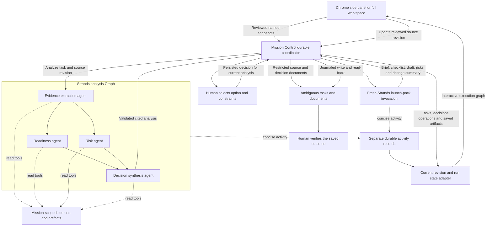

# Adaptive launch review with Strands

Adaptive launch review turns reviewed product requirements, engineering status, and customer feedback into a cited decision brief and a launch pack. Strands runs the evidence and analysis agents; Mission Control keeps the human decision, task dependencies, document delivery, and recovery durable. Ambiguous holds the assigned tasks and restricted shared documents.

The supplied **Harbor launch** example is fictional and editable. It deliberately promises a calendar integration that engineering says is unavailable. Its example text is not evidence of a real product or customer research. Choosing the sample still uses the selected live model through Strands; adaptive execution has no fixture fallback.

## Architecture



There are three fixed workspace tasks: **Analyze → Human decision → Produce launch pack**. The analysis task uses four distinct Strands agents. Readiness and risk execute concurrently, and decision synthesis requires both branches to succeed. The selected human and agent remain the task owners; Strands agent nodes are internal execution roles, not additional workspace identities. The SDK's [Graph documentation](https://strandsagents.com/docs/user-guide/concepts/multi-agent/graph/) describes dependency execution and joining branches.

Tools are read-only: `list_mission_sources`, `read_mission_source`, and `read_mission_artifact`, plus `list_mission_artifacts` and the bounded batch tools `read_mission_sources` and `read_mission_artifacts`. Model tool calls run serially; the readiness and risk Graph branches still run concurrently. The server binds accessible IDs to the current mission and source revision. Sources are data; instructions embedded in them cannot authorize tools, writes, external browsing, or new participants. Citations carry a source ID, revision, and literal excerpt. Structured findings and launch-pack results are checked before being accepted, including whether cited excerpts occur in retrieved source snapshots. See [Strands structured output](https://strandsagents.com/docs/user-guide/concepts/agents/structured-output/) for the SDK mechanism.

The coordinator, rather than model tools, saves documents through the existing operation journal and verifies content and sharing by read-back. Each source revision gets a current mission brief. Outcome verification covers the current revision while retaining historical documents. Human waiting happens outside the Strands invocation. Recording a decision starts a fresh invocation using persisted inputs. Closing the panel leaves the local server working; stopping the server interrupts model work and requires recovery or retry.

## Reading the execution graph

The execution view shows **Analyze → Human decision → Produce launch pack** below the mission controls. Analyze expands into evidence extraction, readiness and risk in parallel, then synthesis. Select a node to inspect concise activity, correlated tool outcomes, available timing, source references, and saved documents. The human node links to the existing decision form. The workspace uses a horizontal layout; the Chrome side panel stacks stages while retaining the two parallel branches. Node buttons support keyboard selection and visible focus, and motion follows the system reduced-motion preference.

The graph combines persisted task, decision, operation, artifact, and activity records for the current source revision and task run. It does not infer agent success from an invocation-ended event: success requires an accepted structured result. “Saving decision” lasts until the review document and task are verified. **Documents saved** means the launch deliverables were saved and read back; **Mission verified** additionally requires the existing human outcome attestation. Model and tool counters come from the authorized cumulative budgets, not the number of detail records.

Source changes reset the graph to the current revision and display its change summary; older documents remain in artifact history. Missing older activity has unavailable details rather than invented timing or success. Polling continues every three seconds. A refresh failure marks the view stale and retains the last confirmed state. Pause prevents new dispatch while accurately showing an invocation that is still finishing. Cancelled, failed, blocked, and uncertain results retain distinct states; uncertain document writes require reconciliation. The graph shows live state, with no historical playback controls.

## Setup

Follow [local setup and pairing](setup.md) for Node.js, pnpm, the loopback server, and the unpacked extension. Preserve an existing `.env`; credentials stay server-side. The installed SDK is pinned in the server package and lockfile.

Adaptive review requires `MODEL_MODE=live`. It uses the existing explicit provider choice:

| Choice | Required server configuration | Transport |
| --- | --- | --- |
| Amazon Bedrock (default) | `MODEL_PROVIDER=bedrock`, `AWS_REGION=us-west-2`, `BEDROCK_MODEL_ID=us.amazon.nova-2-lite-v1:0`, and standard AWS credential-chain access | Bedrock Converse in `us-west-2` |
| OpenRouter | `MODEL_PROVIDER=openrouter`, `OPENROUTER_API_KEY`, `OPENROUTER_MODEL` | `https://openrouter.ai/api/v1` |
| Direct OpenAI | `MODEL_PROVIDER=openai`, `OPENAI_API_KEY`, `OPENAI_MODEL` | `https://api.openai.com/v1` |

Use a selected model that supports tools and the configured structured-result mechanism. For Amazon Nova 2 Lite, Strands validates the schema through its bounded tool-based structured-output path. Bedrock uses the AWS SDK's standard credential chain: prefer a least-privileged runtime IAM role on AWS, or a reviewed local profile for development. Adaptive review preserves the chosen provider, model, and region or endpoint; an unavailable model, invalid result, missing authentication, or unsupported capability is an explicit error. Another vendor's credential and fixture output are never fallback choices.

Workspace mode is separate. `PROVIDER_MODE=fixture` permits a real-model rehearsal with simulated workspace records. Fully connected acceptance requires `PROVIDER_MODE=live`, the intended workspace's `AMBIGUOUS_API_KEY`, and matching `AMBIGUOUS_EXPECTED_USER_ID` and `AMBIGUOUS_EXPECTED_WORKSPACE_ID`. Verify the discovered identities before selecting the human and agent. A real-model run against fixture storage is not evidence of Ambiguous delivery.

Default limits are two concurrent agents, six model turns per agent invocation, 4,096 output tokens per model response, and four minutes per outer run. Across source revisions and retries, each mission can use at most 40 model calls and 60 tool calls. Calls consumed before a failure count. The existing outer agent-run budget also applies. Exhaustion blocks further work without silently increasing the authorized budget.

## Repeatable demonstration

1. Pair the side panel or full workspace. Choose **New mission → Adaptive launch review** and the editable fictional sample. Select the intended human reviewer and working agent.
2. Read the three source snapshots. Keep the conflicting calendar promise for the first pass. Each mission accepts one to five named sources totaling at most 20,000 content characters. Pasted material is supported. Browser material must be explicitly accepted and reviewed; temporary capture context is never automatically copied into a mission source.
3. Start the mission. In the execution graph, observe evidence extraction followed by readiness and risk in parallel, then decision synthesis. Select each node for activity and tool outcomes; expand the activity log for the full bounded record. Open the saved source and decision documents. Check the cited excerpts against the source text.
4. Select the human decision node to reach the existing decision form. Choose the recommended option, or another supplied option, and record a concrete constraint such as “Disclose manual date entry; do not promise calendar integration.” Observe **Saving decision** while its document and task are verified; production remains gated until saving succeeds. A generic approval comment or a task status changed directly in Ambiguous is insufficient.
5. Open the saved launch pack from the document-delivery node or artifact list. Check the brief, readiness checklist, announcement draft, unresolved risks, and change summary. Confirm the recorded human constraint is reflected. **Documents saved** still awaits human outcome verification, and the announcement remains a draft.
6. Update **Engineering status** to say the integration has passed acceptance and broader rollout awaits owner approval. Save a new source revision. Check the graph's revision label and change summary as its nodes reset. The original documents stay available; all three task identities remain stable while their versions advance. The previous analysis, decision, pack, and outcome acceptance become outdated. Observe a fresh analysis and make a fresh decision before the revised pack is produced.
7. Open the actual Ambiguous records and verify assignments, document text, restricted visibility, and selected participant access. Verify the mission outcome only after inspecting the saved deliverables. A completed adaptive mission must be explicitly reopened before another source update.
8. Reload both views while waiting for a decision. They should reconstruct the persisted sources, analysis, activity, decisions, and artifact links. A server restart during human waiting should preserve the wait without repeating the analysis.

Source updates require an idle mission with no model run or external write in flight. Requests include an ID and expected revision; duplicate requests are idempotent, changed payloads under one request ID and stale revisions are rejected. Completed missions require reopening. Unknown external write outcomes must be reconciled before work resumes or sources change.

For a recovery demonstration, use a dedicated test mission and simulate a lost provider response with the controlled test harness. Reconcile the returned provider ID and verify that neither document creation nor the completed model call repeats. Do not create production uncertainty by deliberately disrupting a live write.

## Scripted connected rehearsal

The [adaptive demo CLI](../scripts/adaptive-demo.ts) connects to an already running dedicated backend. It does not start servers, read `.env`, change the model, or enable live modes. `--help` works without credentials or network access. Every external mutation requires `--execute`; omitting it prints the exact payload and saves a private local request journal. Preview uses a private cached local session and read requests, and makes no Ambiguous or model writes.

```sh
node --import tsx scripts/adaptive-demo.ts --help
export MISSIONDECK_BASE_URL=http://127.0.0.1:4332
export MISSIONDECK_ORIGIN=http://127.0.0.1:5173
export MISSIONDECK_DATA_DIR=/absolute/path/to/dedicated/backend/data
node --import tsx scripts/adaptive-demo.ts start
node --import tsx scripts/adaptive-demo.ts start --execute
node --import tsx scripts/adaptive-demo.ts status
```

Set `MISSIONDECK_HUMAN_ID` and `MISSIONDECK_AGENT_ID` to exact discovered IDs if either roster has multiple choices. The CLI selects automatically only when there is exactly one valid identity of each kind. An alternative to the explicit data-directory pairing-code file is `MISSIONDECK_PAIRING_CODE` in the environment; never put the code in command arguments or recordings. The pairing credential is needed for the first command and again only if the cached session expires, is rejected, or no longer matches the selected backend and origin. The default source is the fictional sample. `start --sources /absolute/path/to/sources.json` uses an explicitly reviewed source array instead.

Read the saved brief and use an actual option ID shown by `status` in place of `OPTION_ID`:

```sh
node --import tsx scripts/adaptive-demo.ts decide --option OPTION_ID --constraints 'Disclose manual date entry; do not promise calendar integration.'
node --import tsx scripts/adaptive-demo.ts decide --option OPTION_ID --constraints 'Disclose manual date entry; do not promise calendar integration.' --execute
node --import tsx scripts/adaptive-demo.ts status
node --import tsx scripts/adaptive-demo.ts export
```

Exports contain the current `sources.json`, full execution snapshot, artifact Markdown files, and a manifest in a private timestamped directory. Copy `sources.json` to a new reviewed file and edit the engineering snapshot, then supply that file explicitly:

```sh
node --import tsx scripts/adaptive-demo.ts update --sources /absolute/path/to/revised-sources.json
node --import tsx scripts/adaptive-demo.ts update --sources /absolute/path/to/revised-sources.json --execute
node --import tsx scripts/adaptive-demo.ts status
```

Make the fresh decision with the new option ID after reanalysis. Once the revised pack is saved, inspect the actual documents and record your own verification statement in place of the example below:

```sh
node --import tsx scripts/adaptive-demo.ts verify --attestation 'I read the saved launch pack and verified the stated requirements.'
node --import tsx scripts/adaptive-demo.ts verify --attestation 'I read the saved launch pack and verified the stated requirements.' --execute
node --import tsx scripts/adaptive-demo.ts export
```

For further changes after completion, run `reopen` to preview, then `reopen --execute` before the next source update. `--mission-id UUID` selects an existing adaptive mission when the journal does not already belong to another mission. Use a separate `MISSIONDECK_DEMO_DIR` for another rehearsal; its default is the gitignored `artifacts/demo-video/adaptive` directory.

The CLI persists request IDs and exact payloads **before dispatch**. If a response is lost, repeat the same command and arguments; idempotent endpoints receive the original payload. Preserve the journal when a revision conflict or unknown result is reported. Verification uses the existing completion API and an uncertain verification request is never automatically replayed: inspect status and reconcile it in Mission Control. A local lock prevents concurrent CLI mutations from replacing one another's journal; after a process crash, inspect its saved PID before removing a stale lock. The CLI never logs or copies the pairing code. It atomically caches the origin- and backend-bound session token in `session.json` beside the journal with owner-only permissions, honors the server expiry, and re-pairs only when an authenticated read rejects a cached token. The final demo directory and session cache must be real current-user paths with no group or other permissions (normally `0700` and `0600`); symbolic links and permissive caches are rejected without replacement. Mutation requests are never automatically replayed after an authentication failure.

## Verification and evidence

Run the deterministic coordinator regression suite with:

```sh
pnpm exec vitest run apps/server/src/adaptive-execution.test.ts
```

The suite covers the human gate, current-analysis decisions, idempotency, source revision changes, preserved documents and task identities, explicit reopening, cancellation, interrupted analyses and human waits, uncertain writes, scoped tool reads, and concurrent cumulative budget reservations. It uses fixture tasks and documents with a controlled runner. Separate SDK tests exercise the real Strands Graph against a controlled model transport.

The 19-scenario coordinator suite and seven CLI regression tests pass. They cover lost-response retries, lease takeover, stale updates, cached-session recovery without mutation replay, rejection of permissive and symbolic-link caches, prevention of duplicate verification, private file permissions, and evidence labels. These checks made no real provider calls. Current SDK, browser, build, and connected acceptance results are recorded in [adaptive acceptance evidence](adaptive-acceptance.md).

The graph browser harness has explicit test-only phase gates. It holds readiness and risk across the normal polling interval, releases readiness first to prove synthesis still waits, and then releases risk. It also exercises refresh interruption/recovery, delayed older responses, correlated tool outcomes, keyboard selection, reduced motion, new source revisions, saved decisions, document delivery, and final human verification. These gates exist only in the isolated fixture server; they simulate runner phases and do not exercise the Strands SDK. SDK outcome and tool-correlation checks are separate.

Record acceptance evidence at the layer actually exercised:

| Layer | Required evidence |
| --- | --- |
| Coordinator regression | Test command, result, and covered revision/recovery scenarios; no claim of live model calls. |
| Strands SDK integration | Real SDK graph and tools against a controlled transport, including parallel-join behavior and invalid-output rejection. |
| Browser | Full workspace and Chrome side-panel runs, reload, source edit, decision, activity, and saved artifact links. |
| Real-model rehearsal | Selected provider and model, real graph activity and outputs, with storage mode stated. |
| Connected acceptance | Dedicated mission ID, actual Ambiguous task/document IDs, verified assignees, content read-back, and restricted sharing with selected participants. |

Record timestamps, source revisions, decision versions, agent/tool activity, and consumed budgets; omit credentials and raw private provider responses. Fixture IDs do not satisfy connected acceptance. Tool activity displays concise summaries rather than raw model reasoning. Neither this operator guide nor a successful build is proof that the browser or connected acceptance scenario has run.

This increment retains the local application and existing generic mission runner. AWS hosting, public browsing, coding execution, arbitrary replanning, and outbound publication remain outside the adaptive launch workflow.
