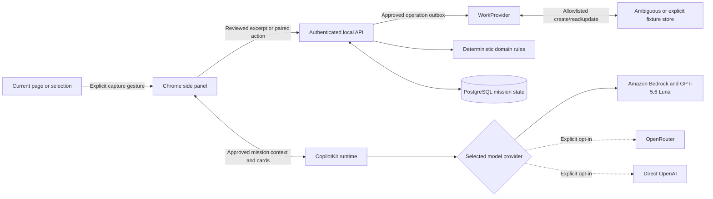

# Architecture

The [mission execution product requirement](mission-execution.md) defines the target: Ambiguous holds tasks, real human/agent assignments, and mission artifacts, while MissionDeck coordinates automatic execution. The execution flow below is implemented for bounded text work. The original planning-only architecture follows it and remains available as a separate workflow.

## Mission execution

`execution-router.ts` accepts an authenticated mission start with explicit selected human/agent identities and task/run limits. `execution-service.ts` records the mission authority and a request hash atomically; a repeated start request returns the same mission. A server worker acquires a durable per-mission lease, generates and validates the task graph, writes native assignments/dependencies, and saves a shared mission brief before dispatching eligible work.

`execution-runner.ts` makes bounded, structured model calls for drafting or synthesis from the supplied context and saved dependency documents. Amazon Bedrock is the default model provider, using GPT-5.6 Luna through the `us.openai.gpt-5.6-luna` inference profile in `us-west-2` and the standard AWS credential chain. OpenRouter and direct OpenAI remain explicit opt-in alternatives. The runner has no tools, network browser, shell, or provider mutation capability. Unsupported work is assigned to humans or reported blocked. The selected Ambiguous agent identity owns the native task; execution is performed by MissionDeck's server worker, not a native external agent process.

The optional **Adaptive launch review** template persists `engine: strands` and uses `strands-execution-runner.ts` behind that same interface. Its analysis Graph extracts evidence, joins concurrent readiness/risk agents, and synthesizes a cited decision brief. Source and dependency read tools are bound to reviewed revisions; model/tool budgets and separate activity records are durable. MissionDeck saves the human decision before starting a fresh launch-pack invocation. Source changes retain historical documents and task IDs, invalidate the prior decision and verification, and repeat the three stages. Older missions default to the direct runner. See the [adaptive architecture diagram, limits, and demo](adaptive-launch.md).

The adaptive execution graph is a read model over the existing execution response. A single state adapter combines current source revision, task run IDs, activity, decisions, operation outcomes, and verified artifacts. React, CSS Grid, and SVG render evidence extraction, the parallel readiness/risk branches, synthesis, human decision, launch-pack generation, and document delivery. Node details expose concise activity and document/source references. The diagram adapts to the full workspace and native side panel, follows reduced-motion preferences, and supports keyboard selection.

Activity stays in separate durable records. Its optional typed outcome and SDK tool-call ID preserve older records while distinguishing accepted results, failures, cancellations, and correlated tools. Generic invocation-ended hooks do not establish success. The graph ignores superseded run activity, reports missing older detail as unavailable, and preserves authoritative cumulative budget counters. Existing three-second polling supplies updates; failed refreshes mark the view stale. Saving a generated document, saving the human decision, and human verification remain separate from model execution. No graph endpoint, graph library, or database migration is introduced.

`execution-provider.ts` is the only external-write boundary for this flow. It supports discovered workspace assignees, native tasks, exact dependency edges, restricted documents, and sharing with explicitly selected workspace members. Every mutation has an immutable journal entry and verified read-back. An interrupted mutation becomes uncertain and cannot be blindly repeated; a retained or manually identified provider record can be reconciled. Fixture mode has separate persisted, visibly simulated records.

Human tasks wait for dependencies. Feedback supplied through MissionDeck is saved as a shared review document; a native Ambiguous task marked done must also contain review feedback before dependent work proceeds. Agent output is retained before artifact persistence, so a failed save can resume without another model run. Final completion saves an outcome-verification document and atomically attests the mission criteria. Closing the panel does not stop the server worker. Pause stops new work; cancellation aborts the model and retains records already written.

Execution records and operation journals use scoped `upgrade_records`; migration 003 adds unique start-request identity and worker leases. Managed execution missions reject mutations through legacy planning/proposal endpoints. Model/workspace mode changes block continuation, preventing simulated output from being written into a live execution after restart.

## Original planning-only workflow

Mission Control separates contextual assistance from authority. A person approves a precise persisted proposal; the server validates and records that approval before executing any provider write. The extension is a view and a user-triggered capture surface, not the workflow database or a long-running worker.

## Repository responsibilities

| Path | Responsibility |
| --- | --- |
| `apps/extension` | MV3 manifest, gesture-based side panel, capture preview, settings, mission views, CopilotKit components |
| `apps/server` | Pairing/authentication, scoped API, structured model requests, approvals, durable outbox, provider adapters, migrations |
| `packages/domain` | Zod schemas, typed proposals, dependencies, criterion coverage, capacity-aware projections, fixture scenario |
| `packages/ui` | Shared accessible UI primitives and visual tokens |
| `packages/workers` | Phase-two boundary; no durable research worker enabled |
| `fixtures` | Clearly labeled requirements/scenario material |
| `docs` | Setup, integration evidence, privacy, demo, and validation notes |

## Persistent state

The default database is persistent PGlite, an embedded PostgreSQL implementation; a `pg` connection supports the separate local PostgreSQL service. The schema contains missions, criteria, tasks, evidence, proposals, approvals, operations, artifacts, events, sessions, fixture-provider storage, and the outbox.

The mission JSON aggregate is the read model. Child entity projections are saved in the same transaction for unique constraints and auditability. Owner and workspace scope are applied to mission reads. Session tokens are stored as hashes in the database, expire after 24 hours, and bind to the paired origin. The loopback demonstration uses a fixed local owner/workspace, not a hosted tenant system.

The extension's selected mission ID and session storage are convenience state. A panel reopen retrieves the mission from the backend; an interrupted conversation does not discard the proposal or grant it approval.

## Approval and execution

1. A model, fixture handler, or person prepares a typed proposal against a mission revision. A proposal has an expiry and an exact payload hash.
2. The review component permits edits, rejection, or an explicit approval request. Editing requires another review of a new payload; a chat response alone cannot approve anything.
3. The server verifies actor/workspace scope, proposal state, expiry, current revision, hash, domain rules, and operation permissions.
4. A local transaction records the approval, logical operations, and outbox entries. Provider-owned fields on existing tasks remain the last observed values until verified read-back.
5. The outbox consumer performs one allowlisted provider operation outside the transaction. Each task has its own outcome; several creates do not form an atomic vendor transaction.
6. The provider record is read by its returned real ID, and a second local transaction stores its fingerprint, synchronization result, and concise event history.

Duplicate approvals cannot enqueue the same logical proposal again. An interrupted claimed outbox operation is marked `outcome_unknown` at restart. The system does not infer that a timed-out write failed, and does not blindly recreate it.

The live adapter deliberately supports only title, description, and discovered system-status updates. Dependencies, executor planning, effort, deadlines, criterion verification, and blockers remain Mission Control metadata. A pre-write fingerprint check protects observed human edits; the vendor currently provides no documented conditional task update, so there remains a narrow read/PATCH race documented in [integrations](integrations.md).

## Planning, evidence, and verification

Mission lifecycle (`draft`, `active`, `completed`, `archived`) is separate from health (`on_track`, `at_risk`, `blocked`, `unknown`). Health derives from the deterministic schedule and unresolved work. The list scheduler respects real dependencies, estimated remaining effort, one task per human owner, and a configured agent capacity. It assumes continuous availability, not real working calendars. Unknown durations or blockers prevent a precise ETA.

Accepted evidence is normalized, hashed, redacted, and deduplicated. Exact duplicates do not create new tasks. Possible semantic duplicates require review. In fixture mode, a bounded detector recognizes the labeled two-minute demo-video requirement; it does not pretend to understand arbitrary requirements. The live model adapter uses constrained output plus deterministic plan validation and exact excerpt checks.

Recovery offers at most two proposals and preserves required work. Deferring optional polish or starting genuinely independent drafting does not resolve the original blocker. Deadline changes affect the local contract only, and cannot extend an external event deadline by themselves.

External `done` becomes **reported complete**. Required criteria need separate evidence review or a logged human attestation before the mission can be completed. A task count is progress, not a probability of success.

## Extension and runtime boundaries

The toolbar/context-menu gesture opens `sidePanel` immediately; asynchronous capture delivery uses a small expiring inbox. The capture preview is excluded from the CopilotKit context until accepted. `activeTab` grants temporary access, with honest manual fallback when unavailable. All executable assets are bundled locally under MV3 CSP.

CopilotKit v2 registers controlled mission components, minimal context, and navigation/proposal tools. Its Express runtime sits behind the same authentication and origin restrictions as the application API. Model proposals pass through server validation; model or frontend tool names never confer approval authority.

The bounded in-memory CopilotKit runner retains recent conversation events only while the server process survives. It is separate from PostgreSQL mission persistence. Open-ended model-generated UI is explicitly disabled; the application registers its own controlled React components. The compatibility boundary between the installed Express 4 adapter declarations and the Express 5 host is isolated at the router mount and covered by a real adapter discovery test.

Phase-two Trigger.dev/Exa research is disabled. Adding it later requires a durable job status store, an approved public query, bounded execution, an authenticated reachable persistence path, and artifact-only automatic completion. Mission changes must continue through the same approval boundary.

## Incremental workspace ownership

| Responsibility | Implementation |
| --- | --- |
| BrowserContextProvider | Extension `browser-context.ts`: trusted browser identity, exact grants, extraction and screenshot boundaries |
| ContextSessionManager | Extension `context-session.ts`: memory-only consent, epochs, selected sources, coalescing and frozen requests |
| Temporary sharing | Server `context-router.ts`: authenticated identity, immutable request IDs, expiry and revocation |
| AmbiguousWorkspaceProvider | Server `workspace-provider.ts`, `workspace-mapping.ts`, `workspace-destination.ts`: closed native paths, identity/preflight and semantic read-back |
| ArtifactCoordinator / PolicyGuard | Server `artifact-coordinator.ts`, `artifact-router.ts`: typed exact plans, separate authority categories, expiring digests and durable outcomes |
| RoutineDiscovery / AutomationCompiler | Domain `routines.ts`, server `routines.ts`: consented deterministic matching, validated scope, zero-write preview and explicit schema blockers |
| Run reconciliation | Existing mission service plus artifact reconciliation and `native-routine-inspector.ts`; unknown outcomes never cause blind create/send retries |
| Scoped persistence | Existing mission aggregate/outbox plus `UpgradeStore` and additive migration 002 |

CopilotKit keeps the existing installed v2 APIs for contextual conversation, controlled previews and human feedback. Backend routes own authorization and execution. Native Ambiguous workflows remain the intended primary routine engine; missing authenticated node schemas block compilation rather than selecting a duplicate local scheduler. Browser worker lifetime is not an execution dependency for approved backend artifact work. This remains a local fixed user/workspace deployment, not hosted multi-tenancy.
